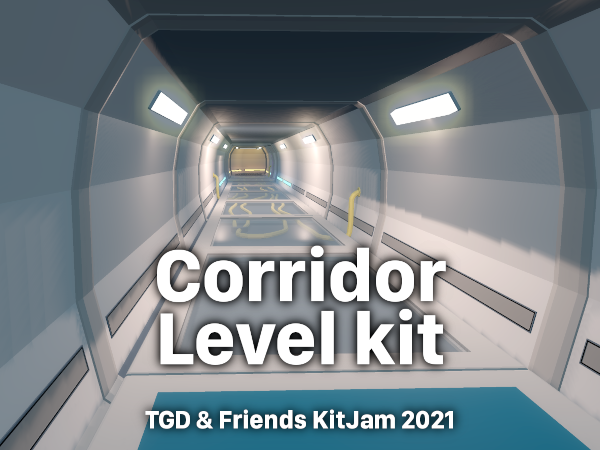
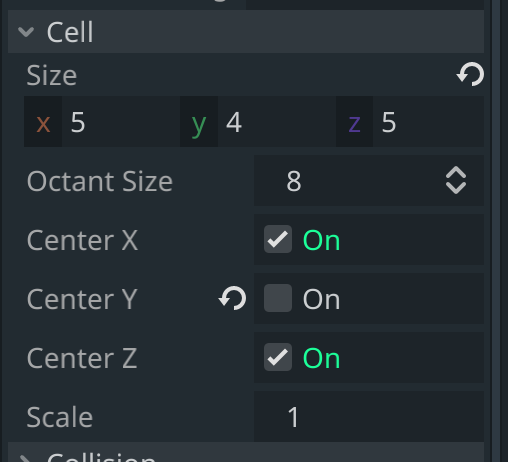

# TGD & Friends KitJam 2021

Here you can find my contribution's source files to the TGD KitJam 2021.

&rarr; [Get me to that jam's homepage!](https://itch.io/jam/tgd-friends-kit-jam-2021)  
&rarr; [No, get me directly to your actual contribution page!](https://dueddel.itch.io/kitjam-2021)

## Contents

| File | Description |
|-----:|:------------|
| `KitJam-2021-08.blend` | the master source file for pretty much the whole level kit, it's compatible with Blender 2.79 and up (no questions about why I am using 2.79 and not 2.8x or 2.9x, I have my reasons) |
| `KitJam-2021-08.fbx` | FBX export of the level kit for importing into game engines like Unity or Unreal Engine |
| `KitJam-2021-08.glb` | glTF export of the level kit for importing into game engines like Godot |
| two `*.png` images | textures for UV mapping the 3D models of the level kit, the textures are used as color palettes |
| `/wip` | directory containing "work in progress" screenshots and renders that I made during development of the level kit |
| `/Godot Sample Project` | directory containing a sample level in the Godot game engine that has been built using this level kit |
| `/itch` | directory containing screenshots from the Godot sample project for submitting my jam results to the itch.io project page |

## How to

Preamble: I am only experienced with the Godot game engine, I have no idea how to prepare anything for UE and Unity.

That being said, you're lucky when using Godot. I prepared something for you to play around with, so you don't have to follow the next instructions. Just open the sample project and/or copy its files into your own project.

But generally spoken, all you have to do is …

### Import the files into your game engine

1. open your project directory
2. copy either the `*.fbx` or `*.glb` file to your project directory
3. copy the `sky-pirate-studios-palette-8x.png` to the same directory
4. switch to your game engine, it should probably automatically import the files

The imported models come with three materials:  
`rough`, `glas` and `emissive`

Unfortunately you now have to …

### Setup the materials

1. drag'n'drop the palette texture (that `*.png` file) onto the albedo fields of all three materials
2. enable transparency for the `glas` material, also play around with its metallic and specular properties to create a slight mirror effect since this material has been named `glas` for a reason ;)
3. enable emission for the `emissive` material and give it some nice lightened look, if desired activate "glow" or "bloom" in world or environmental settings

And finally you can …

### Create a mesh library / tile set

First of all, each tile of this level kit has a dimension of  
`5m × 5m × 4m` (`width × depth × height`)

I don't know much about how it works in UE and Unity, but in Godot there's a thing called `GridMap`. After converting the tiles into a `MeshLibrary` and putting it into the grid map's `mesh_library` field you have to set the `cell_cize` according to the tiles's dimensions. Feel free to also check the `center_cell_x` and `center_cell_z` checkboxes.

Only one thing left …

### Build a level

This falls to you. Have fun, I'd say. :)

## Used 3rd party assets

* [Imphenzia Gradient palette](https://www.dropbox.com/s/1w98xiksiwaywqx/ImphenziaPalette01-256-Gradient.png) (only used for some practicing objects)
* [Sky Pirate Studios Palette](https://lospec.com/palette-list/sky-pirate-studios-palette) (used for all final assets)
